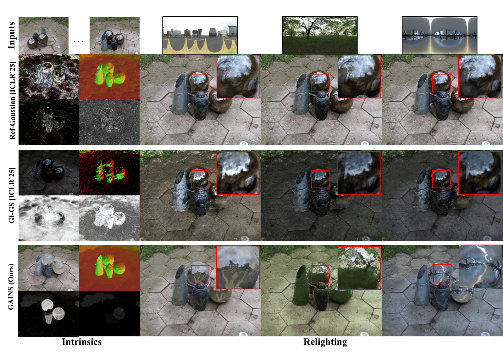

<h2 align="center">
  GAINS: Gaussian-based Inverse Rendering from Sparse Multi-View Captures
</h2>
<h4 align="center">ECCV 2026</h4>
<div align="center">
  <a href='https://patrickbail.github.io' target='_blank'>Patrick Noras<sup>1,2</sup></a>&emsp;
  <a href='https://chedgekorea.github.io/' target='_blank'>Jun Myeong Choi<sup>3</sup></a>&emsp;
  <a href='https://av.dfki.de/members/stricker/' target='_blank'>Didier Stricker<sup>1,2</sup></a>&emsp;
  <a href='https://www.cs.wm.edu/~ppeers/' target='_blank'>Pieter Peers<sup>4</sup></a>&emsp;
  <a href='https://www.cs.unc.edu/~ronisen/' target='_blank'>Roni Sengupta<sup>3</sup></a>&emsp;
  <br>University of Kaiserslautern-Landau<sup>1</sup>, German Research Center for Artificial Intelligence<sup>2</sup>,
University of North Carolina at Chapel Hill<sup>3</sup>, College of William & Mary<sup>4</sup><br>
</div>
<p align="center">
  <a href="https://arxiv.org/abs/2512.09925" target='_blank'></a>
  <a href="https://patrickbail.github.io/gains/" target='_blank'></a>
</p>
The official implementation of "GAINS: Gaussian-based Inverse Rendering from Sparse Multi-View Captures".

<p align="center"></p>

### Installation
The code has been tested with `python=3.10.14`, `torch=2.5.1` and `torchvision=0.20.1` with CUDA 12.1. We strongly recommend using these versions, as we cannot guarantee that the code will run with newer or older versions.

1. Clone GAINS and download the pre-trained SAM 2 model. Also download [enviroment maps](https://drive.google.com/file/d/1KzkB6I6b8ol3fCVLETHJWv5LkVWvrkpC/view?usp=sharing) required for MI-SDS and place them in the root folder.
```bash
git clone --recursive https://github.com/NVlabs/InstantSplat.git
cd gains
mkdir -p checkpoints/
wget https://dl.fbaipublicfiles.com/segment_anything/sam_vit_h_4b8939.pth -P checkpoints/
```

2. Create the environment using conda.
```bash
conda create -n gains python=3.10.14 cmake=3.14.0 -y
conda activate gains
pip install torch==2.5.1 torchvision==0.20.1 torchaudio==2.5.1 --index-url https://download.pytorch.org/whl/cu121
pip install -r requirements.txt
pip install submodules/simple-knn
pip install submodules/diff-gaussian-rasterization
pip install submodules/diff-gaussian-rasterization-blend-seg
pip install submodules/pytorch3d 
```

### Datasets
GAINS has been primarily tested on one real dataset, [Ref-Real](https://storage.googleapis.com/gresearch/refraw360/ref_real.zip), Ref-Real, and two synthetic datasets, [Shiny Blender](https://storage.googleapis.com/gresearch/refraw360/ref.zip) and [Synthetic4Relight](https://drive.google.com/file/d/1wWWu7EaOxtVq8QNalgs6kDqsiAm7xsRh/view). For the Shiny Blender dataset, we additionally rendered albedo and relit images for further evaluation. These can be downloaded [here](https://drive.google.com/file/d/18JlGKbkU23OD_Pzfw-TcB3dnWTPS-atO/view?usp=sharing). here. Make sure to place these folders inside `gains/data`.

### Priors
GAINS utilizes priors for both Stage I and Stage II. For depth and normal priors, we use [Marigold](https://github.com/prs-eth/marigold) and therefore strongly recommend using this monocular estimator to generate these maps for Stage I. Place the `depth_npy` and `normals_npy` folders inside the respective scene folders. If the priors are generated at a different resolution for the real data (we recommend a resolution of 8), the folder names should instead follow the format `depth_npy_{resolution}` and `normals_npy_{resolution}`.
\
For Stage II, we use [Teamwork](https://github.com/samsartor/teamwork) to generate albedo maps for synthetic data and [RGB2X](https://github.com/zheng95z/rgbx) for real data. For synthetic data, make sure the folder is named `iid_teamwork`, while for real data it should be named `iid_npy_{resolution}_rgb2x`. These folders should be placed in the scene root directory.
\
Scripts for running Teamwork and RGB2X are provided in `iid_scripts` if needed.

### Training
We provide a run script for each dataset. For example, to train on Synthetic4Relight, simply run:
```
sh scripts/train_syn4r.sh
```

<details>
<summary><span style="font-weight: bold;">Command Line Arguments for train.py</span></summary>

  #### Stage I
  #### --lambda_dr 
  Weight of depth ranking loss

  #### --lambda_pl 
  Weight of pearson depth loss

  #### --lambda_mono_normal 
  Weight of monocular normal prior loss

  #### --lambda_bce 
  Weight of mask bce loss

  #### Stage II
  #### --lambda_intra_seg 
  Weight of ICC loss

  #### --lambda_iid 
  Weight of IID loss

  #### --iid_model 
  Name of IID model being used

  #### --lambda_diff 
  Weight of SDS/MI-SDS loss

  #### Miscellaneous
  #### --iteration
  Number of total iteration for training

  #### --sparse
  Number of input images

  #### --scope
  The scope of images to pick from given sparse number. Set 0 -1 for full range

  #### --srgb
  Boolean if input images are in nonlinear sRGB space

  #### --strength_La
  Strength of albedo uniformity term inside ICC

  #### --strength_r
  Strength of roughness inside ICC specularity term
  
</details>

### Evaluation
We also provide an evaluation script for each dataset. For example, to evaluate on Synthetic4Relight, simply run:
```
sh scripts/eval_syn4r.sh
```

## Acknowledgements

We would like to thank the following excellent works on which our work is built:
- [Ref-Gaussian](https://github.com/fudan-zvg/ref-gaussian)
- [2DGS](https://github.com/hbb1/2d-gaussian-splatting)
- [FatesGS](https://github.com/yulunwu0108/FatesGS)

## Citation
Please consider citing our work, if you found it useful in your research

```bibtex
@inproceedings{noras2025gains,
      title={GAINS: Gaussian-based Inverse Rendering from Sparse Multi-View Captures}, 
      author={Patrick Noras and Jun Myeong Choi and Didier Stricker and Pieter Peers and Roni Sengupta},
      year={2026},
      booktitle={ECCV}, 
}
```


